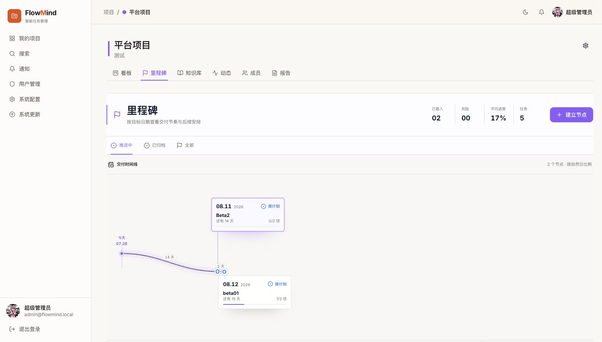
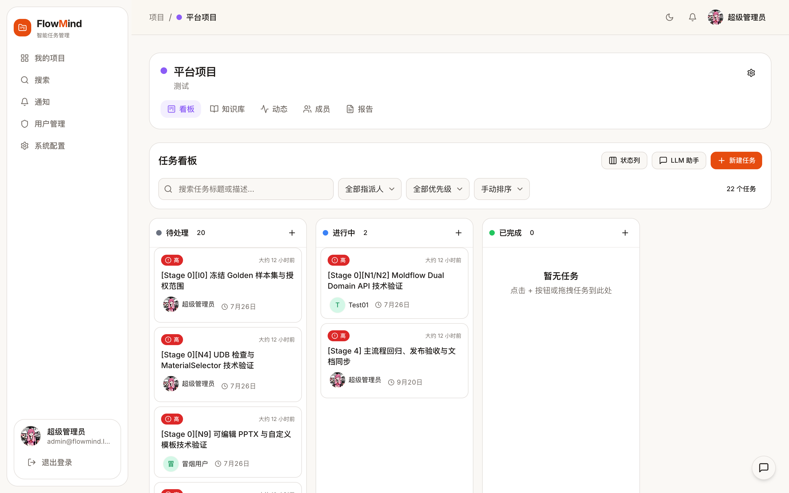
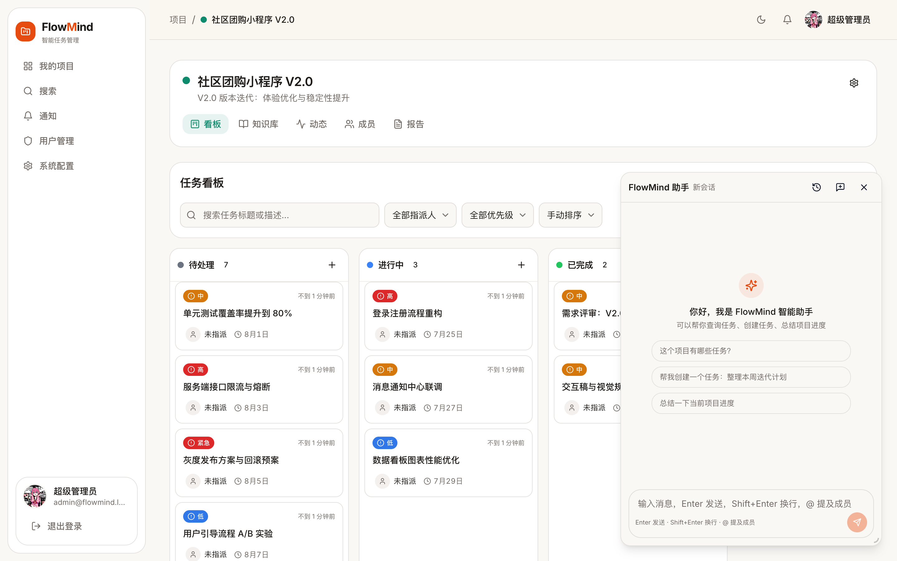
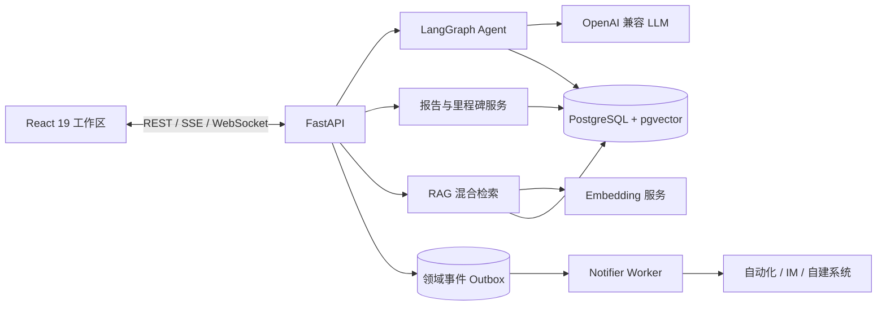

<div align="center">
  
  <h1>FlowMind</h1>
  <p><strong>把任务、知识、时间与 AI 收进同一个交付现场。</strong></p>
  <p>面向真实团队协作的智能项目管理平台。AI 不只是回答问题，它理解项目身份、读取知识、管理任务与里程碑，并留下可追溯的执行过程。</p>
  <p>
    <a href="https://github.com/lxfight/flowmind/actions/workflows/ci.yml"></a>
    <a href="https://github.com/lxfight/flowmind/releases"></a>
    <a href="LICENSE"></a>
  </p>
  <p>
    <a href="https://lxfight.github.io/flowmind/">产品文档</a> ·
    <a href="#快速开始">快速开始</a> ·
    <a href="#v040">版本变化</a> ·
    <a href="docs-site/architecture/index.md">架构说明</a>
  </p>
</div>



## 从计划到交付，不丢失上下文

FlowMind 把项目事实放在同一个连续工作区中：任务在看板上推进，里程碑按真实日期间隔展开，知识库保留决策依据，报告沉淀阶段结果。LLM 助手在这套权限与项目边界内工作，而不是成为悬浮在数据之外的聊天窗口。

<table>
<tr>
<td width="50%" valign="top">

### 时间有形

多里程碑沿柔和曲线按自然日比例排布。当前时间从左侧进入视野，未来节点按距离展开；历史数据游标分页、按需加载，长周期项目仍保持流畅。

</td>
<td width="50%" valign="top">

### 交付共享

报告历史与生成状态属于项目，不属于单个浏览器会话。成员看到同一份进度、同一条生成状态；报告可直接吸收里程碑、任务和项目上下文。

</td>
</tr>
<tr>
<td width="50%" valign="top">

### 助手可观测

模型明确感知当前用户与权限。思考内容、工具调用和结果分区记录；多次调用逐条编号、独立展开，参数与结构化结果不再挤成一段字符串。

</td>
<td width="50%" valign="top">

### 知识可执行

PDF、DOCX、PPTX、Markdown 等文档自动解析索引。向量语义与关键词通过 RRF 融合；助手既能检索证据，也能通读完整文档并据此拆解任务。

</td>
</tr>
</table>

<table>
<tr>
<td width="50%">
  
  <p><strong>安静而高密度的项目看板</strong><br />筛选、排序、负责人、优先级、截止日期和里程碑在同一工作面中完成。</p>
</td>
<td width="50%">
  
  <p><strong>嵌入项目现场的 LLM 助手</strong><br />会话按用户与项目隔离，写操作可撤销，工具过程可检查。</p>
</td>
</tr>
</table>

## 核心能力

| 工作域 | 能力 |
|---|---|
| 看板协作 | 拖拽任务、自定义状态列、任务 ID、`#` 跨任务引用、子任务、多人指派、评论提及、筛选与排序 |
| 里程碑 | 全状态统一时间线、多节点管理、任务互斥归属、自然日比例曲线、游标分页与懒加载 |
| LLM 助手 | 项目与跨项目会话、用户身份注入、SSE 流式响应、工具调用、撤销与幂等写入 |
| 报告 | 项目级共享历史、成员间生成状态同步、超时重试、里程碑上下文与 Markdown 输出 |
| 知识库 | 多格式解析、向量与关键词混合检索、相似度门槛、全文读取 |
| 权限安全 | 注册审批、项目角色、JWT、bcrypt、登录限流、初始化管理员凭据保护 |
| 外部集成 | 项目级 Webhook、Transactional Outbox、HMAC 签名、SSRF 防护、重试与投递历史 |
| 系统运维 | LLM 与 Embedding 独立配置、密钥脱敏、在线升级、备份检查与中断恢复 |

## v0.4.0

这一版本让项目内部关系和外部自动化形成连续的交付信号链。

- **任务编号与引用**：任务卡片和详情稳定展示 ID；描述与评论可通过 `#` 引用同项目任务，并查看双向关系。
- **完整里程碑时间线**：不再按视图分类截断，全部状态统一展示在真实日期时间线上。
- **可靠外部通知**：任务、评论和里程碑事件通过 Transactional Outbox 与独立 notifier 投递，支持 HMAC、SSRF 防护、指数退避和人工重试。
- **可升级的服务编排**：在线更新器动态识别目标版本服务集合，升级和回滚都会正确处理 notifier。

完整兼容性说明与升级步骤见[版本变化文档](docs-site/guide/releases.md)。

## 架构一览


```mermaid
graph LR
    UI[React 19 工作区] <-->|REST / SSE / WebSocket| API[FastAPI]
    API --> AGENT[LangGraph Agent]
    API --> REPORT[报告与里程碑服务]
    API --> RAG[RAG 混合检索]
    API --> OUTBOX[(领域事件 Outbox)]
    AGENT --> LLM[OpenAI 兼容 LLM]
    RAG --> EMB[Embedding 服务]
    AGENT --> PG[(PostgreSQL + pgvector)]
    REPORT --> PG
    RAG --> PG
    OUTBOX --> NOTIFIER[Notifier Worker]
    NOTIFIER --> EXT[自动化 / IM / 自建系统]
```

## 快速开始

### Docker Compose

```bash
git clone https://github.com/lxfight/flowmind.git
cd flowmind
cp .env.example .env
./scripts/deploy.sh
```

首次启动前可在 `.env` 中设置管理员凭据与 LLM 配置：

```env
FLOWMIND_ADMIN_USERNAME=your-admin
FLOWMIND_ADMIN_PASSWORD=your-secure-password
LLM_API_KEY=
```

打开 [http://localhost](http://localhost)。如果未预设管理员密码，可通过以下命令读取首次启动时生成的随机密码：

```bash
docker compose logs backend
```

`FLOWMIND_ADMIN_USERNAME` 只在空数据库首次初始化时生效，账号创建后用户名保持不可修改。没有 LLM Key 时，知识库自动降级为关键词检索，其余项目管理能力仍可使用。

### 本地开发

<details>
<summary><strong>后端</strong> · Python 3.12+ / uv</summary>

```bash
docker compose up -d postgres
cd backend
uv sync
uv run uvicorn app.main:app --reload --port 8000
```
</details>

<details>
<summary><strong>前端</strong> · Node 20+</summary>

```bash
cd frontend
npm install
npm run dev
```
</details>

<details>
<summary><strong>SQLite 开发模式</strong></summary>

```env
DATABASE_URL=sqlite+aiosqlite:///./flowmind.db
```

SQLite 模式下向量检索降级为关键词检索，其余功能不受影响。
</details>

## 关键环境变量

| 变量 | 说明 | 默认值 |
|---|---|---|
| `DATABASE_URL` | 数据库连接串 | PostgreSQL Compose 服务 |
| `JWT_SECRET` | JWT 签名密钥，生产环境必须显式设置 | 自动生成 |
| `FLOWMIND_ADMIN_USERNAME` | 首次初始化的管理员用户名 | `admin` |
| `FLOWMIND_ADMIN_PASSWORD` | 初始管理员密码，要求 8–128 位，预设值不写入日志 | 随机生成 |
| `LLM_API_KEY` / `LLM_BASE_URL` | LLM 凭据与 OpenAI 兼容地址 | 未设置 |
| `EMBEDDING_API_KEY` / `EMBEDDING_BASE_URL` | 独立 Embedding 服务，留空时回退到 LLM 配置 | 未设置 |
| `LLM_EMBEDDING_MODEL` / `LLM_EMBEDDING_DIM` | 向量模型及维度 | `text-embedding-3-small` / `1536` |
| `LLM_REPORT_TIMEOUT` | 报告生成总时限，包含重试 | `180` 秒 |
| `FLOWMIND_IMAGE_REGISTRY` | FlowMind 发布镜像仓库前缀，应用内更新同样使用 | `ghcr.io` |
| `FLOWMIND_UPDATE_MIN_FREE_BYTES` | 更新备份后的最小剩余空间 | `1 GiB` |
| `INTEGRATION_ENCRYPTION_KEY` | Webhook 签名密钥的服务端加密密钥 | 生产环境必须固定设置 |
| `PUBLIC_APP_URL` | 外部通知中的 FlowMind 链接前缀 | 相对路径 |

全部配置项见[配置说明](docs-site/guide/configuration.md)。LLM、Embedding 与检索参数也可由超级管理员在系统配置页在线调整。

## 技术基线

| 层 | 技术 |
|---|---|
| 前端 | React 19 · TypeScript · Vite 6 · Tailwind CSS · Zustand · dnd-kit · Framer Motion · Lucide |
| 后端 | FastAPI · SQLAlchemy Async · Alembic · LangGraph · OpenAI SDK |
| 数据 | PostgreSQL 17 · pgvector；SQLite 可用于降级开发 |
| 检索 | 向量余弦相似度 · CJK bigram · RRF 融合 |
| 质量 | ESLint · TypeScript · Vitest · Ruff · pytest · GitHub Actions |

## 项目结构

```text
FlowMind/
├── backend/       FastAPI、Agent、RAG、报告与领域服务
├── frontend/      React 工作区与 Lucide 图标体系
├── docs-site/     VitePress 产品与运维文档
├── scripts/       部署、更新与版本检查
├── updater/       独立更新编排与恢复服务
└── docker-compose.yml
```

<div align="center">
  <a href="LICENSE">MIT License</a> · Built by <a href="https://github.com/lxfight">lxfight</a>
</div>
